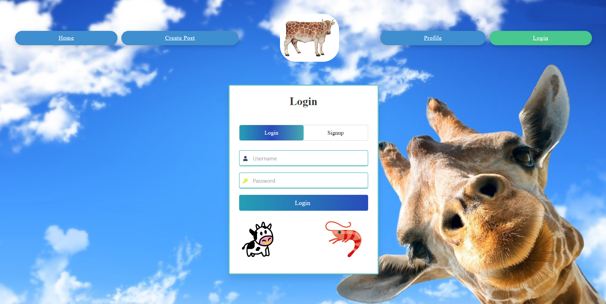
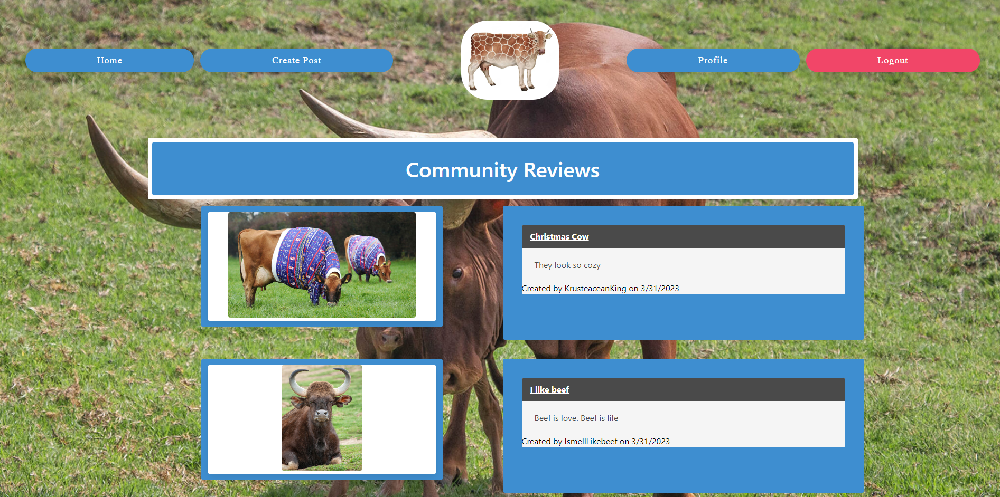
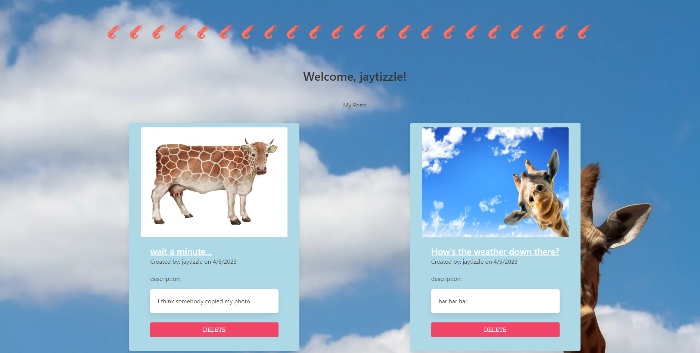

# The Cow, Shrimp, Giraffe Blog
  [](https://opensource.org/license/mit-0/)

  ## Table of Contents
  * [Description](#description)
  * [Installation](#installation)
  * [Links](#links)
  * [License](#license)
  * [TechnologyUsed](#technologyused)
  * [Credits](#credits)

  ## Description
  User Story

```md
  Our project is called "Rate my Cow/Giraffe", an image sharing website dedicated to cows and giraffes. 
  Users can sign up by entering a username, password, email address, and age. The user's data will be 
  saved and they will be able to join the community. Once logged in, users may create their own posts 
  consisting of a title, description, and an image of their choice. The profile page allows the user 
  to view their own posts. Other users may log in and view everyone's posts on the community reviews 
  page. They can also click on another user's post and leave a comment. 
```


  ## Installation
* clone repo
* install node
* install packages (npm i)
* open terminal and login to mysql
* type source db/schema.sql then exit
* add seeds using node seeds/index.js
* npm start

  ## Links
Application Screenshots:





Link to Deployed Application: https://polar-temple-53244.herokuapp.com/login

Link to Github Repository: https://github.com/maxr-e/group-6-not-null

  ## TechnologyUsed
  * Bcrypt
  * Bulma
  * Connect-session-Sequelize
  * Dotenv
  * Express, Express-Handlebars, Express-Session
  * Mysql2
  * Chalk
  * Sequelize
  
  ## License
  MIT License

  ## Credits
  Created by Safiya Shrader, Max Royal-Eisenberg, Jordan Pace, Jonathan Chen as part of the UC Berkeley Extension Bootcamp.
